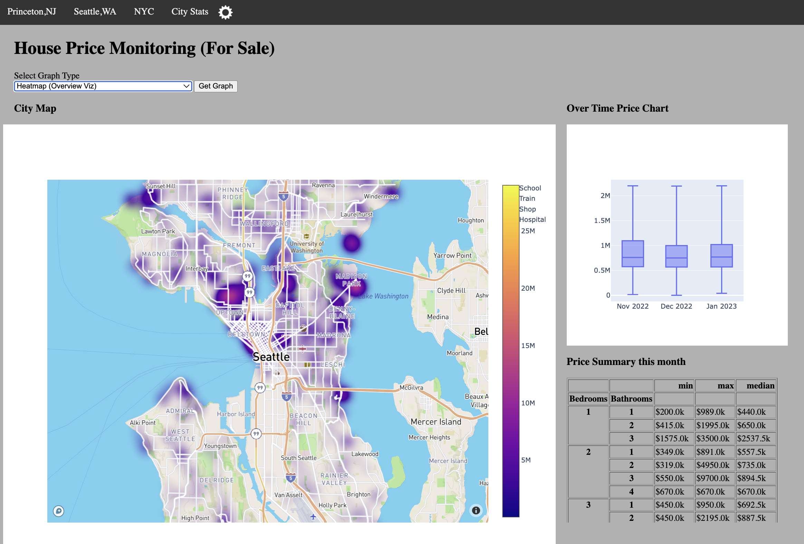
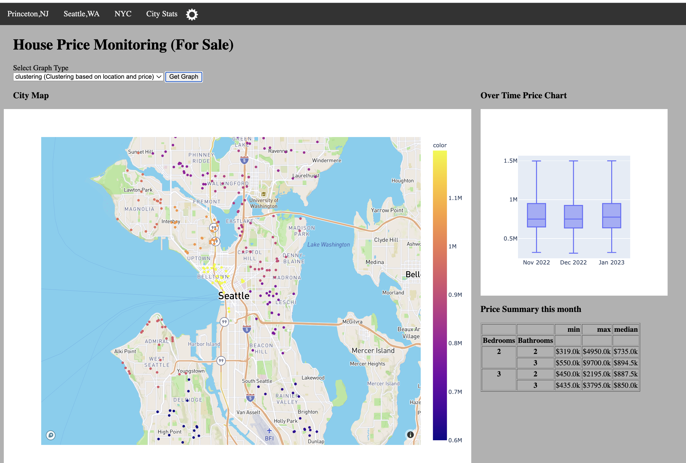
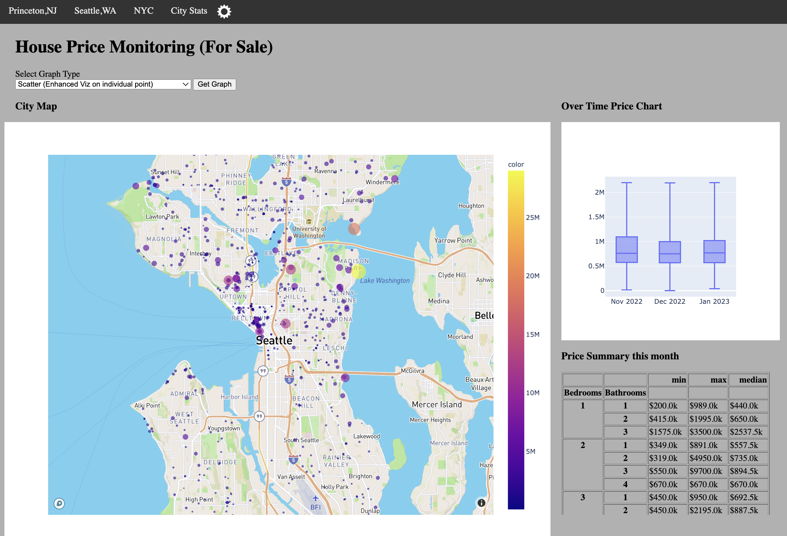
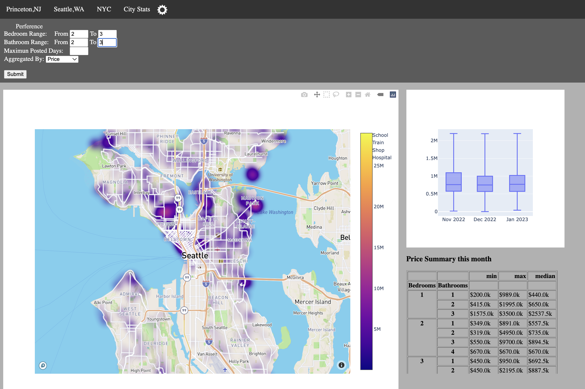

# Simple Housing Price APP

# Intro
- This app shows housing price heatmap by location, it also monitors monthly house price changes. Since it depends on scrapped house price, scraping
  would be done manually to prevent website blocking. To automate this part, an ideal solution would be using Cron Job.
  After monthly scraping, do the following command to sync database and the app will show the updates right after.
- For data security purpose, I remove the scraping part from the git repo.
- The app is intended for individual user to have an insight of their local housing price to make wise investment decisions, not intended for business use whatsoever. Therefore, I do not add user log in functionalities.
- Current supported City: 1. Princeton, NJ 2. NYC,NY 3. Seattle,WA

# Features
- Currently support multiple Map types: 
  1. heatmap to see overview price map
  2. scatter plot to see individual price
  3. clustering to see which area has higher or lower price (use Kmeans algorithm)
- Nearby schools, stores, train station, etc are also shown in the map using Google Map api
- User can customize price stats by click on setting icon






# To Run
## access token
You need Google Map API token and Plotly token. \
Please visit the website to create a token. \
Then put the token string in this directory: \
google map api token: ./housing/access_token/gmap.txt \
plotly api token: ./housing/access_token/mapbox.txt

## create a customized crawler
Create a housing price python crawler and then put it in this directory: \
./housing/utils/crawled_data/<some-crawler>.py


## create a conda env and activate it
```
$ conda create -n housing python=3.8
$ conda activate housing
$ pip install -r requirements.txt
```

## initialize the Database
```
$ flask --app housing init-db
```


## update the Database (scrape data first then update the DB)
```
$ cd ./housing/utils/
$ python <some-crawler.py>
$ flask --app housing update-db-monthly <month in the format of year-month>
```

## run the app (go to http://localhost:5000)
```
$ flask --app housing --debug run
```

Reference:
The fUll tutorial to create a flask app: https://flask.palletsprojects.com/en/2.2.x/tutorial/
